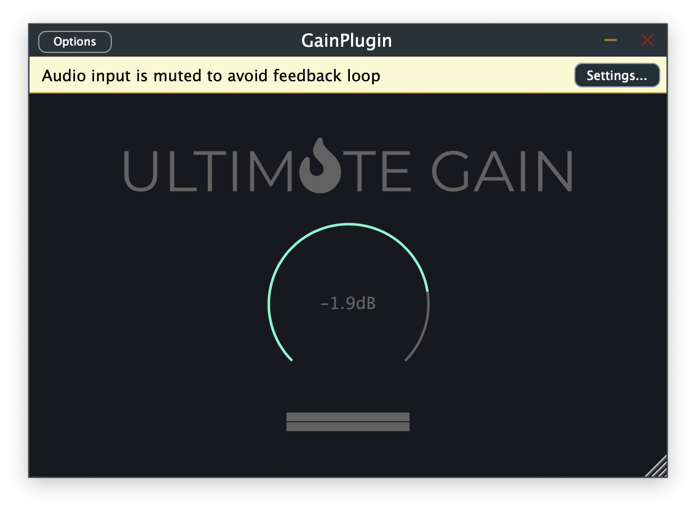

# Running the GainPlugin Example project

This step assumes you've already reviewed the [Getting Started](Getting_Started.md) guide. If not,
please start there!

## GainPlugin



React-JUCE includes an extremely simple utility gain plugin to demonstrate the minimal
code required for integrating React-JUCE into a JUCE project. To get it running,
we only need two steps: compiling the JavaScript bundle, and then compiling and
running the native code.

### JavaScript Bundle

All React-JUCE projects have two components: we have the native code that knows how
to mount the React application into our JUCE project and satisfy calls from React's
reconciler, and then we have the React.js application code that we want to run in the
native environment. In order to ease this handoff, we're using a tool in this
example called [Webpack](https://webpack.js.org/) that can compile a complete JavaScript project into a single
file. That single file is then the only thing we need to execute in the native
environment.

To get the GainPlugin up and running for the first time, we have to first perform
that compilation step. So, from the root of the `React-JUCE` git repository:

```bash
$ cd examples/GainPlugin/Source/jsui/
```

The `jsui/` directory here is the top level directory of all the
React.js application code that we used to build the example interface.
We use a build step managed by npm to compile all of our application javascript
into a single file that can be easily loaded up in the native app:

```bash
$ npm install
$ npm run build
```

At this point, you'll see an output file in `examples/GainPlugin/Source/jsui/build/js/`. That file location is important, because that's where the native code looks for executing the output file.

### Native

Now that we have our JavaScript bundle, the last step is simple: just hit Build and
Run from your IDE! When the JUCE PluginEditor gets initialized, it will find your
JavaScript build and evaluate it within the embedded interpreter to draw the
GainPlugin interface.

## Hot Reloading

The GainPlugin example is preconfigured with hot reloading, so that as you edit
the React application code, your interface will redraw itself instantly. In order
to take advantage of this, we need to recompile our JavaScript bundle on the
fly as we're editing our code. Fortunately, Webpack makes that simple, so from
within the `jsui/` directory:

```bash
$ npm start
```

This will first build your JavaScript bundle, then wait and watch your source files
for changes. When it finds a change, it will pick that change up and incrementally
rebuild your bundle. In turn, React-JUCE will pick up the change to the bundle file
and redraw your interface.

Now that you're up and running, take a minute to tweak the GainPlugin React
application to get a sense of the workflow! When you're done, let's move on to
the next step, [adding React-JUCE to your own project](New_Project.md).
